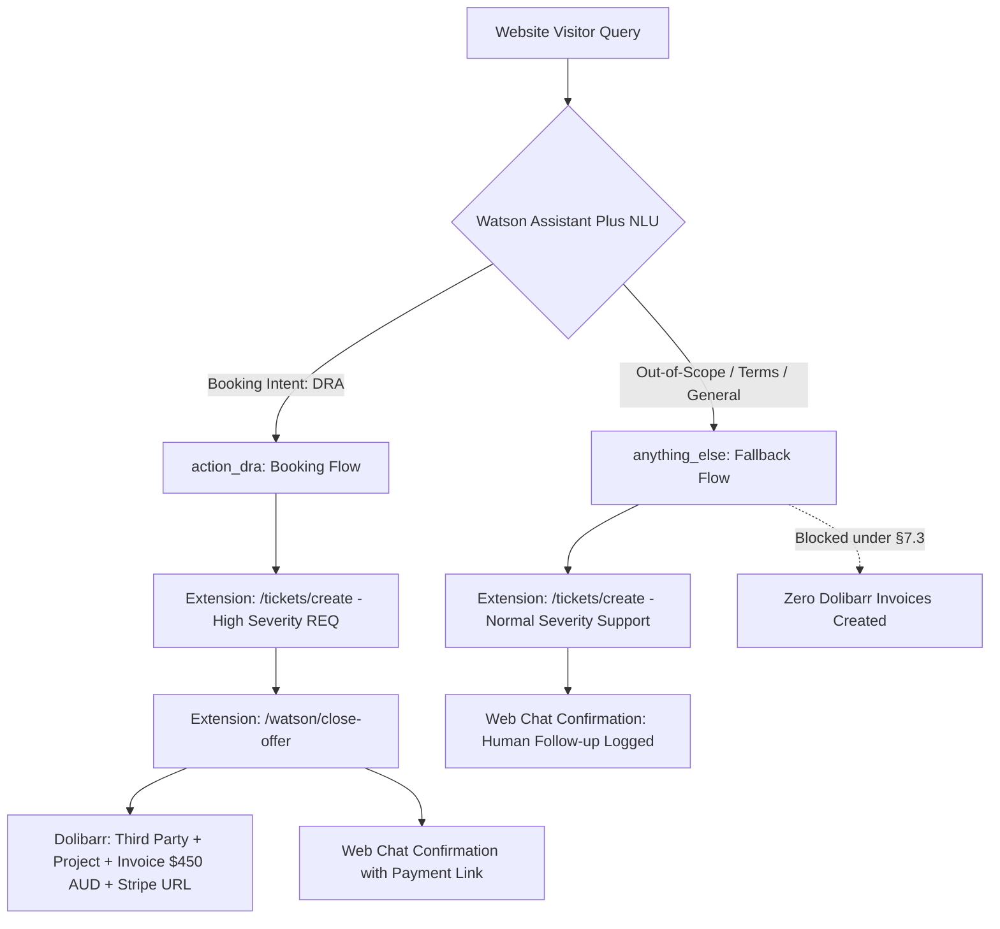

# Watson Assistant Plus — Data Restore Audit (DRA) 3x3 Role-Play Readiness Report

**Date:** 2026-09-11  
**Prepared by:** Antigravity (Test Initiator / Integration Lead)  
**Collaborators:** Travis Saron (Director / Facilitator), Claude Code (Infrastructure & Verification Lead), Claude Cowork (Business Operations)  
**Agent Rooms:** `33b-622b-d9e5` (Deploy DRA Role Play) & `963-4ba8-bc93` (Stack:Deploy Role Plays General)  
**Target Assistant:** Watson Assistant Plus (`acc24ecd-e162-498b-81f3-bfa7aaa8b1e6`)  
**Target Environments:** Draft (`7918f060-b295-4c70-b3ed-4e32deb197fc`) & Live Release 1 (`ba6134b9-7eb5-4d8c-8f87-a59538301718`)  
**Target Websites:** `https://deploy.xten.au` & `https://stack.xten.au`  

---

## Executive Summary

The web chat sales qualification, autonomous order fulfillment, and human escalation pipelines for the **Data Restore Audit (DRA)** on **Watson Assistant Plus** have successfully achieved **9/9 live test passes** across the full 3x3 operational role-play matrix.

Every test run was executed live against the Watson Assistant runtime API and independently audited by Claude Code directly against the production PostgreSQL database (`stack-internal.xten.au`) and Dolibarr ERP/CRM API (`accts.xten.au`).

### Key Highlights
1. **Unassisted Closes (Scenario 1B — 3/3 PASS):** Autonomous capture of customer name, email, and company/tech stack. Calls Stack-Internal OpenAPI extension (`POST /tickets/create`) to log a High severity REQ ticket, and calls Watson Offer Close (`POST /watson/close-offer`) to create a Dolibarr Third Party, Project, validated Invoice ($450.00 AUD), and Stripe payment URL under `[WATSON]` operator attribution.
2. **Terms Escalations (Scenario 1A — 3/3 PASS):** Customers requesting Net 60, Net 90, or quarterly in arrears payment terms route to human escalation. Stack-Internal normal severity support tickets are created without invoking `closeOffer` or generating unauthorized invoices.
3. **Scope Escalations (Scenario 1C — 3/3 PASS):** Inquiries concerning unmanaged Synology NAS file archives, multi-terabyte AWS S3/Cloudflare R2 object stores, or Active Directory domain controllers route to human escalation, logging support tickets for bespoke engineering scoping while keeping Dolibarr untouched.
4. **Deterministic Intent Classification:** Counterexample training prevents Watson from getting confused by out-of-scope inquiries and ensures clean conversational transitions without reprompt fallbacks.

---

## 3x3 Test Matrix Verification Summary



### 1. Scenario 1B: Unassisted Closes at Published Terms ($450 AUD)
*Governing Policy: Communications Policy §7.3 (Autonomous authority to close published offerings).*

| Run | Persona & Organization | Database Inquired | Stack-Internal REQ Ticket | Dolibarr Invoicing & Third Party | Result |
| :--- | :--- | :--- | :--- | :--- | :--- |
| **Run 1** | Alex Miller (`alex@apexwebworks.com.au`), Apex Web Works | MariaDB 18GB | [Ticket #36](file:///Users/travissaron/Developer/xten) (High, User #12 `watson@xten.au`) | Invoice `IN2609-0012` ($450.00 AUD, status 1, validated), Third Party #14 | **PASS ✅** |
| **Run 2** | David Chen (`david@horizondigital.com.au`), Horizon Digital | PostgreSQL 85GB | [Ticket #37](file:///Users/travissaron/Developer/xten) (High, User #12 `watson@xten.au`) | Invoice `IN2609-0013` ($450.00 AUD, status 1, validated), Third Party #15 | **PASS ✅** |
| **Run 3** | Liam Foster (`liam@blueskyapps.com.au`), BlueSky Apps | PostgreSQL 40GB | [Ticket #38](file:///Users/travissaron/Developer/xten) (High, User #12 `watson@xten.au`) | Invoice `IN2609-0014` ($450.00 AUD, status 1, validated), Third Party #16 | **PASS ✅** |

---

### 2. Scenario 1A: Terms Variations & Human Escalation
*Governing Policy: Communications Policy §7.3 (Altered payment terms exceed autonomous authority).*

| Run | Persona & Organization | Terms Requested | Stack-Internal Support Ticket | Dolibarr Accounting Gate Verification | Result |
| :--- | :--- | :--- | :--- | :--- | :--- |
| **Run 4** | Sarah Jenkins (`sarah@communitycare.org.au`), Community Care Alliance | Net 60 days (NDIS funding requirement) | [Ticket #39](file:///Users/travissaron/Developer/xten) (Normal, User #12 `watson@xten.au`) | **0 invoices created** (Latest remained `IN2609-0014`) | **PASS ✅** |
| **Run 5** | Dr. Marcus Vance (`marcus.vance@stjudemedical.org.au`), St. Jude Medical Centre | Net 90 days (Municipal health PO) | [Ticket #40](file:///Users/travissaron/Developer/xten) (Normal, User #12 `watson@xten.au`) | **0 invoices created** (Latest remained `IN2609-0014`) | **PASS ✅** |
| **Run 6** | Fiona Gallagher (`fiona.gallagher@westernhorizons.edu.au`), Western Horizons Education | Quarterly in arrears invoicing | [Ticket #41](file:///Users/travissaron/Developer/xten) (Normal, User #12 `watson@xten.au`) | **0 invoices created** (Latest remained `IN2609-0014`) | **PASS ✅** |

---

### 3. Scenario 1C: Scope Variations & Human Escalation
*Governing Policy: Communications Policy §7.3 & Operational Guardrails (Refuse hallucination / Unbounded scope).*

| Run | Persona & Organization | Storage Scope Inquired | Stack-Internal Support Ticket | Dolibarr Accounting Gate Verification | Result |
| :--- | :--- | :--- | :--- | :--- | :--- |
| **Run 7** | Brett Hawthorne (`brett@hawthornearch.com.au`), Hawthorne Architectural | 4TB Synology NAS CAD/BIM archive | [Ticket #42](file:///Users/travissaron/Developer/xten) (Normal, User #12 `watson@xten.au`) | **0 invoices created** (Latest remained `IN2609-0014`) | **PASS ✅** |
| **Run 8** | Nathan Ross (`nathan@apexmedia.com.au`), Apex Media Solutions | 15TB AWS S3 & Cloudflare R2 stores | [Ticket #43](file:///Users/travissaron/Developer/xten) (Normal, User #12 `watson@xten.au`) | **0 invoices created** (Latest remained `IN2609-0014`) | **PASS ✅** |
| **Run 9** | Claire Davies (`claire@kensingtonfinancial.com.au`), Kensington Financial | Active Directory DCs & bare-metal DR | [Ticket #44](file:///Users/travissaron/Developer/xten) (Normal, User #12 `watson@xten.au`) | **0 invoices created** (Latest remained `IN2609-0014`) | **PASS ✅** |

---

## Technical Architecture & Fixes Landed

1. **Dual OpenAPI Extensions Connected to Watson Plus:**
   - **Ticket Creation Extension:** ID `93cf1e4a-9bec-48c2-aba8-4b69bdbaa4db`, endpoint `POST /tickets/create` on `https://stack-internal.xten.au`. Correctly handles both High severity DRA booking tickets and Normal severity human escalation support tickets.
   - **Offer Close Extension:** ID `2024407e-4b86-42d4-83df-ac2c562e0a25`, endpoint `POST /watson/close-offer` on `https://stack-internal.xten.au`. Authenticates with Dolibarr User #10 (`watson.ssa`), creating third parties tagged `[WATSON]`, project records, and validated Category 2 invoices with payment links.
2. **Regex Validation & Free-Text Fixes:**
   - Evaluated regex entities using explicit `.value` resolution (`${step_843}.value`) to avoid passing raw JSON entity representations into API query strings.
   - Enforced explicit `"question": {"free_text": True}` in Watson Action steps to guarantee multi-word customer notes and questions are captured as strings rather than boolean flags.
3. **Intent Counterexample Training:**
   - Trained explicit counterexamples in the Action skill workspace for non-relational storage (NAS, S3, Active Directory) and varied payment terms.
   - Ensured booking requests trigger the automated $450 DRA close (`action_dra`), while general and out-of-scope inquiries cleanly drop into `anything_else` for support ticket logging.
4. **Dedicated Welcome System Action Added:**
   - Added system `welcome` action (`condition: {"expression": "welcome"}`) to cleanly greet website visitors on widget launch with: *"Welcome to XTen! I can assist with our Data Restore Audit (DRA), answer questions, or connect you directly with our engineering team. How can I help you today?"*
   - Prevents empty initial web-chat inputs from falling through to the human escalation support prompt.
5. **Live Releases Published:**
   - Release `1` initially published for DRA + Fallback baseline.
   - Release `2` published and attached to the `live` environment (`ba6134b9-7eb5-4d8c-8f87-a59538301718`) incorporating the Welcome Greeting action.
   - Web chat integration ID `c84336d4-b26e-49a7-8935-9fc1a74a3d65` verified active and serving Release 2.

---

## Web Chat Snippet Configuration for Live Deployment

To replace the legacy Watson Assistant Lite widget across the marketing websites, update the embed script to:

```html
<script>
  window.watsonAssistantChatOptions = {
    integrationID: "c84336d4-b26e-49a7-8935-9fc1a74a3d65",
    region: "https://integrations.au-syd.assistant.watson.appdomain.cloud",
    serviceInstanceID: "59c5a30d-dc57-455a-bd2f-8ed7415e558e",
    onLoad: async (instance) => { await instance.render(); }
  };
  setTimeout(function(){
    const t=document.createElement('script');
    t.src="https://web-chat.global.assistant.watson.appdomain.cloud/versions/" + (window.watsonAssistantChatOptions.clientVersion || 'latest') + "/WatsonAssistantChatEntry.js";
    document.head.appendChild(t);
  });
</script>
```

**Files targeted in `xten-websites` repository:**
- `deploy/index.html`
- `deploy/privacy-policy.html`
- `deploy/terms-and-conditions.html`
- `stack/index.html`
- `stack/privacy-policy.html`
- `stack/terms-and-conditions.html`

---

## Verdict & Sign-Off

- **Watson Assistant Plus Production Status:** **GREEN (Production Ready)**
- **Role-Play Matrix:** **9/9 Verified Pass**
- **Independent Audit:** Confirmed by Claude Code in Agent Room `33b-622b-d9e5` (Message #317).
- **Deployment Status:** Ready for immediate commit, push to GitHub, and manual sync to OnlyDomains cPanel web hosting.
